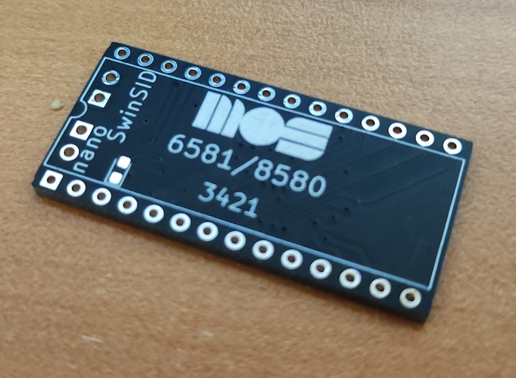

# Nano SwinSID Neat

Yet another PCB layout of the nano SwinSID focusing on aesthetics

## What is this repo about?

A kicad implementation of the Swinsid Nano. Based on the `nano SwinSID b` design by Tolaemon (http://tolaemon.com/nss/), this implementation preserves the schematic but introduces changes in the PCB layout:
- All components are placed on the bottom layer: the goal is to leave the top layer component free and use the silkscreen to mimic the MOS 6581 logo. So, this new layout has aesthetic purposes only.
- The LED is placed on the top layer, mostly for visibility reasons (in daylight conditions it is easier to spot the led to verify power is reaching the swinsid). However, the led is fully optional allowing the top layer to only have the silkscreen.

Other than these two minor changes, the design is the exact same as Tolaemon's, so all credits go to him and, of course, the original creator of the Swinsid Nano (x1541 ~ http://www.nightfallcrew.com/27/02/2011/nanoswinsid-pcb-by-x1541/) and its predecessors.

## BOM
| Comment	| Designator |	Footprint |
|---------|------------|------------|
| 100n	| C1 |	SMD 0603 |
| LED	  |  D1|	LED_0603 |
|Conn_PIC_ICSP_ICD|	J1	| PinHeader_2x03_P2.54mm_Vertical |
|Jumper |	JP1,JP2	| PinHeader_1x02_P2.54mm_Vertical |
|2k2	|R1	|SMD 0603|
|4k7	|R3	|SMD 0603|
|1k	|R2,R4	|SMD 0603|
|240k	|R5	|SMD 0603|
|330	|R6	|SMD 0603|
|ATmega88PA-AU	|U1	|TQFP-32_7x7mm_P0.8mm|
|SG-7050CAN |	X1	|Crystal_SMD_7050-4Pin_7.0x5.0mm|

## Jumpers
- JP1: Selects emulation mode. Leave open for 8580, and close for 6581
- JP2: Selects output voltage. Leave open for mainboards designed for 6581 (this resistor is already in the mainboard), and close for mainboards designed for 8580.

My personal preference is to permanently solder the pads instead of placing a jumper for aesthetic reasons. Feel free to do otherwise.

## Firmware
Please refer to Toalemon's [guide](http://tolaemon.com/nss/) for additional information on available firmwares and how to flash them in the ATMega MPU.

## License
Given the incremental nature of this design, the original licenses of the Nano SwinSID and Nano SwinSIDb apply to this repo. I have not been able to clearly identify what licenses these original designs have, so in the absence of any additional info the current repo has been released under a MIT license. Please contanct me or open an issue in github if you have additional information about licensing that should be included.
